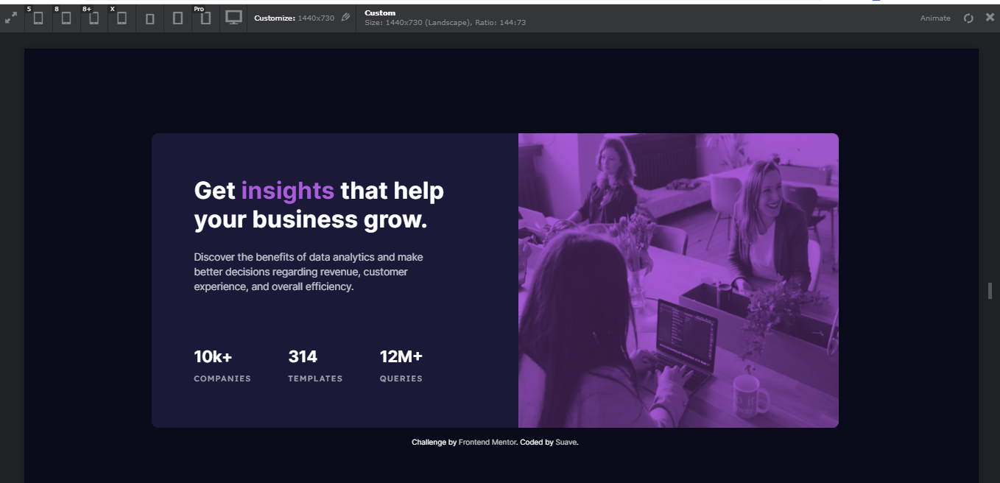
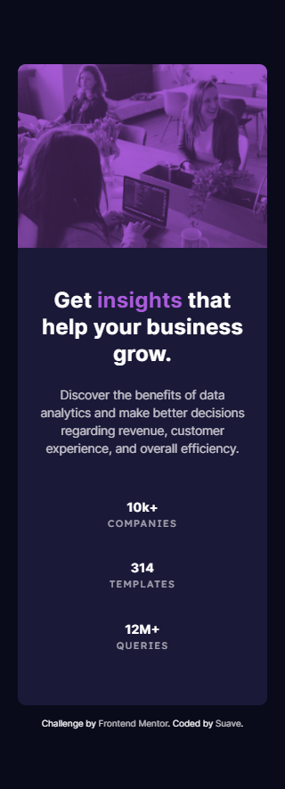

# Frontend Mentor - Stats preview card component solution

This is a solution to the [Stats preview card component challenge on Frontend Mentor](https://www.frontendmentor.io/challenges/stats-preview-card-component-8JqbgoU62). Frontend Mentor challenges help you improve your coding skills by building realistic projects.

## Table of contents

- [Overview](#overview)
  - [The challenge](#the-challenge)
  - [Screenshot](#screenshot)
  - [Links](#links)
- [My process](#my-process)
  - [Built with](#built-with)
  - [What I learned](#what-i-learned)
  - [Useful resources](#useful-resources)
- [Author](#author)

## Overview

A basic challenge to create a card component using HTML and CSS.

### The challenge

Users should be able to:

- View the optimal layout depending on their device's screen size

Design was in image format. So had to make certain judgements on my own.

### Screenshot

### Links

- Solution URL: (https://github.com/suave76/stats_preview_card)
- Live Site URL: (https://suave76.github.io/stats_preview_card/)

## My process

### Built with

- Semantic HTML5 markup
- CSS custom properties
- Flex
- Desktop-first workflow

### What I learned

The main concept i can take from this challenge is that of the flex property.
(A very important property which i was not so well versed at.)
It greatly helped structure the elements in the desired layout in a very easy way.

I also got learn about different blending modes in CSS.
I have used "mix-blend-mode" to get the violet acccent on the image, along with the opacity property.

### Useful resources

- [css-tricks](https://css-tricks.com/snippets/css/a-guide-to-flexbox/) - This helped me understand how flex works. I really liked this pattern and will use it going forward.

- [w3schools](https://www.w3schools.com/cssref/pr_background-blend-mode.asp) - As we all know about w3schools it has always helped me whenever i got stuck. The BLEND modes of css have been explained in a very simple and effective way. This a highly recommended site that will be of great help.

- [MDN](https://developer.mozilla.org/en-US/docs/Web/CSS/CSS_Flexible_Box_Layout/Basic_Concepts_of_Flexbox) - Another one of my goto site when i am having trouble with anything related to development be it HTML, CSS or JS. Highly recommended for beginners as well as experts.

## Author

- Suave Thapa
- Frontend Mentor - [@suave76](https://www.frontendmentor.io/profile/suave76)
- LinkedIn - [Suave Thapa](https://www.linkedin.com/in/suave-thapa-857447190/)
